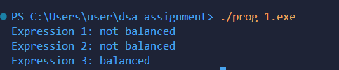

# Program Documentation: Balanced Parentheses Checker

## (a) Explanation of data structures

The program uses a stack data structure implemented using an array.

- `char stack[100];`  
  A fixed-size character array that stores parentheses symbols while checking expressions.

- `int top = -1;`  
  This variable represents the top position of the stack.
  - `top = -1` → stack is empty
  

The stack follows LIFO (Last In First Out) principle:
- Opening brackets are pushed onto the stack.
- Closing brackets pop the top element for matching.

---

## (b) Description of functions

### `void push(char c)`
- **Purpose:** Adds an opening bracket to the stack.
- **Logic:**  
  Checks if stack has space, if yes, increments `top` and stores the character. Otherwise prints `"Stack Overflow"`.

---

### `char pop()`
- **Purpose:** Removes and returns the top bracket from the stack.
- **Logic:**  
  If stack is not empty, returns top element and decrements `top`.  
  If empty, prints `"Stack is empty"` and returns `'\0'`.

---

### `int match(char x, char y)`
- **Purpose:** Checks whether two brackets form a valid pair.
- **Logic:**  
   Return `1` if matching, `0` otherwise.
- **Valid pairs:** `()`, `{}`, `[]`

---

### `int isbalanced(char mathexp[])`
- **Purpose:** Determines whether parentheses in an expression are balanced.
- **Process:**
  1. Reset stack.
  2. Traverse expression character by character.
  3. Push opening brackets.
  4. Pop and compare when closing brackets appear.
  5. Return `0` if mismatch occurs.
  6. After traversal:
     - Empty stack → balanced → return `1`
     - Not empty → unbalanced → return `0`

---

## (c) Overview of `main()` method organization

The `main()` function controls program execution:

1. **Declares test expressions**
   ```c
   char exp1[] = "a + (b-c) * (d";
   char exp2[] = " m+ [a − b ∗ (c + d ∗ {m)]";
   char exp3[] = "a + (b-c)";

## (d) Sample output run

`Output`:
  