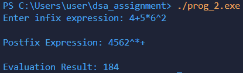

# Program Documentation: Infix to Postfix Conversion and Evaluation

## (a) Explanation of data structures

The program uses **two stack data structures** implemented using arrays.

- `char stackOP[SIZE];`  
  A fixed-size character array used to store operators and parentheses during conversion.

- `int topOP = -1;`  
  Tracks the top position of the operator stack.  
  - `topOP = -1` → stack is empty 

---
- `int stackINT[SIZE];`  
  A fixed-size integer array used to store operands during postfix evaluation.

- `int topINT = -1;`  
  Tracks the top position of the integer stack.  
  - `topINT = -1` → stack is empty

---

Both stacks follow **LIFO (Last In First Out)** principle:
- Elements are inserted using push operations.
- Elements are removed using pop operations.
- The last inserted element is removed first.

---

## (b) Description of functions

### `void pushOP(char x)`
- **Purpose:** Pushes an operator onto the operator stack.
- **Logic:**  
  Increments `topOP` and inserts operator into `stackOP`.

---

### `char popOP()`
- **Purpose:** Removes and returns the top operator from the operator stack.
- **Logic:**  
  Returns `stackOP[topOP--]`.

---

### `void pushINT(int x)`
- **Purpose:** Pushes an operand onto the integer stack.
- **Logic:**  
  Increments `topINT` and stores value.

---

### `int popINT()`
- **Purpose:** Removes and returns top operand from integer stack.
- **Logic:**  
  Returns `stackINT[topINT--]`.

---

### `int precendece(char op)`
- **Purpose:** Determines precedence of operators.
- **Logic:**  
  Returns numeric priority value:
  - `3` → exponent `^`
  - `2` → multiplication/division `* /`
  - `1` → addition/subtraction `+ -`
  - `0` → others

---

### `void infixToPostfix(char infix[], char postfix[])`
- **Purpose:** Converts an infix expression into postfix notation.
- **Process:**
  1. Scan expression left to right.
  2. If operand → append to postfix.
  3. If `(` → push to stack.
  4. If `)` → pop operators until `(` is found.
  5. If operator → pop operators with higher or equal precedence, then push current operator.
  6. After scanning → pop remaining operators.

---

### `int evaluatePostfix(char postfix[])`
- **Purpose:** Evaluates postfix expression.
- **Process:**
  1. Traverse postfix expression.
  2. If digit → push to integer stack.
  3. If operator → pop two operands.
  4. Perform operation.
  5. Push result back to stack.
  6. Final remaining value is returned.

---

## (c) Overview of `main()` method organization

The `main()` function controls overall execution:

1. **Declares input and output arrays**
    ```c
    char infix[SIZE], postfix[SIZE];

2. **Get the user input**
    ```c
    printf("Enter infix expression: ");
    scanf("%[^\n]", infix);

3. **Convert infix to postfix**
    ```c
    infixToPostfix(infix, postfix);

4. **Display postfix and evaluate it**
    ```c
    printf("\nPostfix Expression: %s\n", postfix);
    printf("\nEvaluation Result: %d\n", evaluatePostfix(postfix));

## (d) Sample run of output

