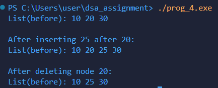

# Program Documentation: Doubly Linked List Operations

---

## (a) Explanation of data structures

The program uses a doubly linked list, where each node contains links to both the previous and next nodes.

- `struct Node`  
  Represents a node in the doubly linked list with three fields:
  - `int data;` → stores the value of the node
  - `struct Node *prev;` → points to the previous node in the list (NULL if first node)
  - `struct Node *next;` → points to the next node in the list (NULL if last node)

- `struct Node* head;`  
  Points to the first node in the list.

This structure allows forward and backward traversal, insertion, and deletion at any position.

---

## (b) Description of functions

### `struct Node* createNode(int value)`
- **Purpose:** Creates a new node with the given value.
- **Logic:**  
  1. Allocates memory for a new node.
  2. Sets `data` to `value`.
  3. Initializes `prev` and `next` pointers to NULL.
  4. Returns the pointer to the new node.

---

### `void insertAfter(struct Node* prevNode, int value)`
- **Purpose:** Inserts a new node after a given node.
- **Logic:**  
  1. Creates a new node with `createNode()`.
  2. Sets `newNode->next` to `prevNode->next`.
  3. Sets `newNode->prev` to `prevNode`.
  4. Updates `prevNode->next->prev` if it exists.
  5. Sets `prevNode->next` to the new node.

---

### `void deleteNode(struct Node** head, struct Node* delNode)`
- **Purpose:** Deletes a given node from the list.
- **Logic:**  
  1. Checks if `head` or `delNode` is NULL.
  2. Updates `head` if `delNode` is the first node.
  3. Updates `next` node’s `prev` pointer.
  4. Updates `prev` node’s `next` pointer.
  5. Frees memory of `delNode`.

---

### `void print(struct Node* head)`
- **Purpose:** Prints the linked list from head to tail.
- **Logic:**  
  1. Traverses from `head` to end using `next` pointers.
  2. Prints each node’s `data` followed by space.

---

## (c) Overview of `main()` method organization

The `main()` function controls program execution:

1. **Declares node pointers**
   ```c
   struct Node* head = NULL;
   struct Node* second = NULL;
   struct Node* third = NULL;

2. **Creating and Linking the nodes**
    ```c
    // creating the nodes
    head = createNode(10);
    second = createNode(20);
    third = createNode(30);

    // linking the nodes
    head->next = second;
    second->prev = head;
    second->next = third;
    third->prev = second;

3. **Insertion**
    ```c
    insertAfter(second, 25);
    printf("\nAfter inserting 25 after 20:\n");
    print(head);

4. **Deletion**
    ```c
    // delete node after 20
    deleteNode(&head, second);
    printf("\nAfter deleting node 20:\n");
    print(head);
---
## (d) Sample out of program

