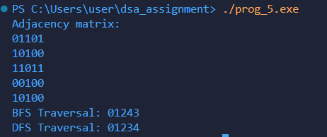

# Program Documentation: Graph Traversal using BFS and DFS

---

## (a) Explanation of data structures

The program represents a graph using an adjacency matrix and uses arrays for traversal.

- `int adj[SIZE][SIZE];`  
  - Stores edges between vertices.  
  - `adj[u][v] = 1` → there is an edge between vertex `u` and vertex `v`.  
  - `adj[u][v] = 0` → no edge.

- `int visited[SIZE];`  
  - Keeps track of visited vertices during BFS or DFS.  
  - `visited[i] = 1` → vertex `i` has been visited.  
  - `visited[i] = 0` → vertex `i` has not been visited.

- `int queue[SIZE];`  
  - Implements a queue for BFS traversal.  
  - `front` and `rear` keep track of queue indices.

- Other variables:  
  - `int front = 0, rear = -1;` -> for queue management in BFS.  
  - `int n` -> number of vertices in the graph.

---

## (b) Description of functions

### `void addEdge(int u, int v)`
- **Purpose:** Adds an undirected edge between vertices `u` and `v`.
- **Logic:**  
  - Sets `adj[u][v] = 1` and `adj[v][u] = 1`.

---

### `void BFS(int start, int n)`
- **Purpose:** Performs **Breadth-First Search** starting from `start`.
- **Logic:**  
  1. Marks all vertices as unvisited.  
  2. Initializes the queue.  
  3. Inserts the start vertex into the queue and marks it visited.  
  4. While the queue is not empty:
     - Dequeue vertex, print it.
     - Enqueue all unvisited neighbors and mark them visited.

---

### `void DFS(int start, int n)`
- **Purpose:** Performs **Depth-First Search** recursively starting from `start`.
- **Logic:**  
  1. Print the current node and mark it visited.  
  2. For each neighbor:
     - If connected and unvisited, recursively call `DFS`.

---

### `void DFS_Start(int start, int n)`
- **Purpose:** Prepares DFS traversal and starts it.
- **Logic:**  
  1. Marks all vertices as unvisited.  
  2. Calls `DFS(start, n)`.  
  3. Prints a newline after traversal.

---

## (c) Overview of `main()` method organization

The `main()` function controls program execution:

1. **Declares number of vertices**
    ```c
    int n = 5;

2. **Adding edges between vertices**
    ```c
    addEdge(0, 1);
    addEdge(0, 2);
    addEdge(0, 4);
    addEdge(1, 2);
    addEdge(2, 3);
    addEdge(2, 4);

3. **Printing the adjacency matrix**
    ```c
    printf("Adjacency matrix: \n");

    for (int i = 0; i < n; i++){
        for (int j = 0; j < n; j++){
            printf("%d", adj[i][j]);
        }
        printf("\n");
    }

4. **Breadth First Search**
    ```c
    BFS(0, n);

5. **Starting Depth First Search**
    ```c
    DFS_Start(0, n);
---

# (d) Sample output of program
