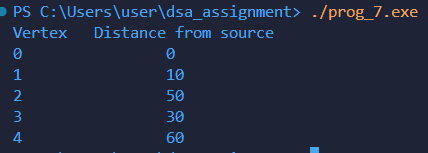

# Program Documentation: Dijkstra's Shortest Path Algorithm

---

## (a) Explanation of data structures

The program represents a weighted undirected graph using an adjacency matrix and uses arrays for tracking distances and visited vertices.

- `int graph[SIZE][SIZE];`  
  Stores weights of edges between vertices.  
  - `graph[u][v] = w` → weight `w` of edge between `u` and `v`  
  - `graph[u][v] = 0` → no direct edge.

- `int dist[SIZE];`  
  Stores the shortest distance from the **source vertex** to each vertex.  
  - Initially all distances are set to `INT_MAX` (∞).  

- `int visited[SIZE];`  
  Tracks which vertices have been finalized (visited).  
  - `visited[i] = 1` → vertex `i` has been processed  
  - `visited[i] = 0` → vertex `i` not yet processed  

- `int n` → number of vertices in the graph.  

---

## (b) Description of functions

### `int minDistance(int dist[], int visited[], int n)`
- **Purpose:** Finds the unvisited vertex with the minimum distance from the source.  
- **Logic:**  
  1. Initialize `min = INT_MAX` and `min_index = -1`.  
  2. Traverse all vertices:  
     - If vertex `i` is unvisited and `dist[i] < min` → update `min` and `min_index`.  
  3. Return `min_index`.

---

### `void dijsktra(int graph[SIZE][SIZE], int n, int source)`
- **Purpose:** Computes shortest distances from `source` to all vertices using Dijkstra's algorithm.  
- **Logic:**  
  1. Initialize `dist[]` with `INT_MAX` and `visited[]` with `0`.  
  2. Set `dist[source] = 0`.  
  3. Repeat `n-1` times:  
     - Select unvisited vertex `u` with minimum distance (`minDistance`).  
     - Mark `u` as visited.  
     - For each neighbor `v` of `u`:  
       - If `v` is unvisited and edge `u-v` exists:  
         - Update `dist[v] = min(dist[v], dist[u] + graph[u][v])`.  
  4. Print the shortest distances for all vertices.

---

## (c) Overview of `main()` method organization

The `main()` function controls program execution:

1. **Declares number of vertices and graph**
   ```c
   int n = 5;
   int graph[SIZE][SIZE] = {
       {0, 10, 0, 30, 100},
       {10, 0, 50, 0, 0},
       {0, 50, 0, 20, 10},
       {30, 0, 20, 0, 60},
       {100, 0, 10, 60, 0}};

2. **Declare source vertex**
    ```c
        int source = 0;

3. **Calling Dijsktra's Algorithm**
    ```c
    dijsktra(graph, n, source);
---
## (d) Sample output of program


