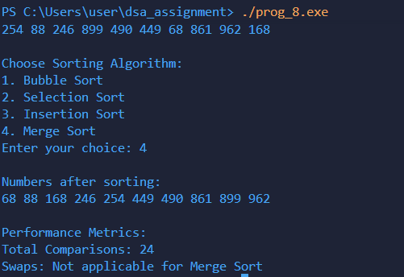

# Program Documentation: Sorting Algorithms with Performance Measurement

---

## (a) Explanation of data structures

The program uses arrays to store elements to be sorted and uses variables to track performance.

- `int arr[n];`  
  - Stores the elements to be sorted.  
  - Size `n` is provided by the user.

- Variables:  
  - `int choice` → stores the user-selected sorting algorithm.  
  - `int n` → number of elements in the array.
  - `long long comparisons` → Counts the total number of comparisons performed during sorting.
  - `long long swapsCount`  →  Counts the total number of swaps performed (not applicable for Merge Sort).

---

## (b) Description of functions

### `void swap(int *a, int *b)`
- **Purpose:** Swaps two integer values.  
- **Logic:** Uses a temporary variable to swap the values at pointers `a` and `b`.

---

### `void print(int arr[], int n)`
- **Purpose:** Prints the array elements.  
- **Logic:** Iterates from `0` to `n-1` and prints each element.

---

### `void bubbleSort(int arr[], int n)`
- **Purpose:** Sorts the array using **Bubble Sort**.  
- **Logic:**  
  1. The algorithm repeatedly iterates through the array.  
  2. In each pass, it compares adjacent elements and swaps them if they are in the wrong order.  
  3. Each pass bubbles the largest unsorted element to its correct position at the end.  
  4. The process continues until the entire array is sorted.  

---

### `void selectionSort(int arr[], int n)`
- **Purpose:** Sorts the array using **Selection Sort**.  
- **Logic:**  
    1. The algorithm selects the **smallest element** from the unsorted portion of the array.  
    2. It swaps this element with the first unsorted element.  
    3. The process continues by moving the boundary of the sorted portion forward.  
    4. This guarantees that the smallest elements are sequentially placed at the start of the array.

---
\\## `void insertionSort(int arr[], int n)`
- **Purpose:** Sorts the array using **Insertion Sort**.  
- **Logic:**  
    1. Each element is compared to elements in the sorted portion of the array.  
    2. It shifts larger elements one position to the right to create space for the current element.  
    3. The current element is then inserted into its correct position.

---

### `void merge(int arr[], int left, int mid, int right)`
- **Purpose:** Merges two sorted subarrays into a single sorted array.  
- **Logic:**  
   1. The left subarray `L[]` contains elements from `left` to `mid`.  
   2. The right subarray `R[]` contains elements from `mid+1` to `right`.  
   3. Elements from both subarrays are compared sequentially, and the smaller element is placed back into the original array.  
   4. Remaining elements from either subarray are appended after one subarray is exhausted.  

---

### `void mergeSort(int arr[], int left, int right)`
- **Purpose:** Sorts the array using **Merge Sort** recursively.  
- **Logic:**  
   1. The array is recursively divided into two halves until each subarray has one element.  
   2. `merge()` is then used to combine these subarrays in a sorted order.  
   3. Merge Sort guarantees a **stable sort** with time complexity O(n log n) in all cases.  

---

## (c) Overview of `main()` method organization

The `main()` function controls program execution:

1. **Input number of elements**
    ```c
    printf("Enter number of elements: ");
    scanf("%d", &n);

2. **Makes an array with random integers**
    ```c
    int arr[n];
    srand(time(NULL));
    for (int i = 0; i < n; i++)
    arr[i] = rand() % 1000 + 1;

3. **Display before sorting**
    ```c
    print(arr, n);

4. **Let user choose the algorithm**
    ```c
    printf("\nChoose Sorting Algorithm:\n");
    printf("1. Bubble Sort\n");
    printf("2. Selection Sort\n");
    printf("3. Insertion Sort\n");
    printf("4. Merge Sort\n");
    printf("Enter your choice: ");
    scanf("%d", &choice);

5. **Displaying the sorted array**
    ```c
    print(arr, n);

6. **Display performance measurements**
    ```c
    printf("Total Comparisons: %lld\n", comparisons);
    if(choice != 4)
        printf("Total Swaps: %lld\n", swapsCount);
    else
        printf("Swaps: Not applicable for Merge Sort\n");
---
## (d) Sample output of program

